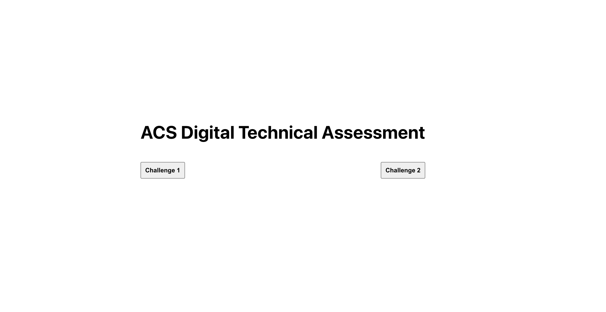
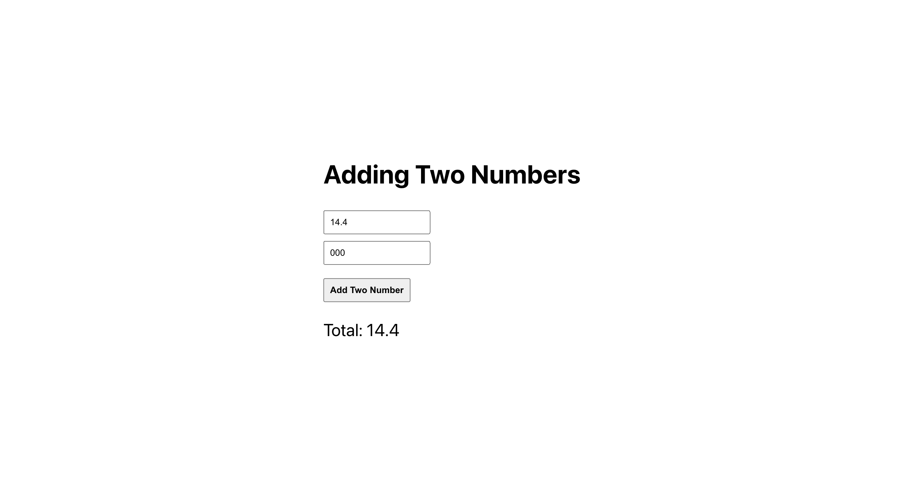
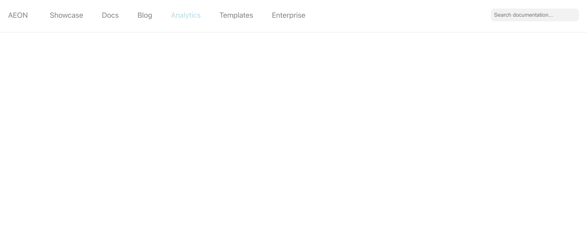
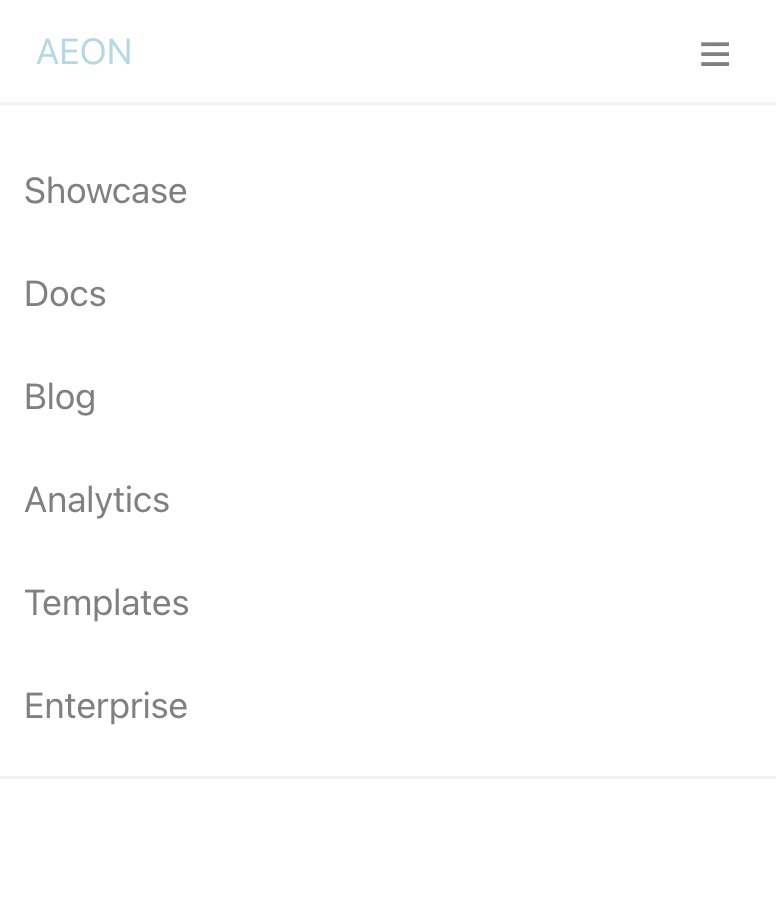

# ACS TEST

This project was bootstrapped with [Create React App](https://github.com/facebook/create-react-app).

## Available Scripts

In the project directory, you can run:

### `npm install`

To install all the necessary dependencies

### `npm start`

Runs the app in the development mode.\
Open [http://localhost:3000](http://localhost:3000) to view it in the browser.

The page will reload if you make edits.\
You will also see any lint errors in the console.



## Challenge 1



[http://localhost:3000/challenge1](http://localhost:3000/challenge1) 

## Challenge 2

 

[http://localhost:3000/challenge2](http://localhost:3000/challenge2)

## Challenge 3

Run this command to execute the code

```
$ node src/pages/answers/challenge3.js  
```

## MCQ

```
src/pages/answers/MCQ.txt
```